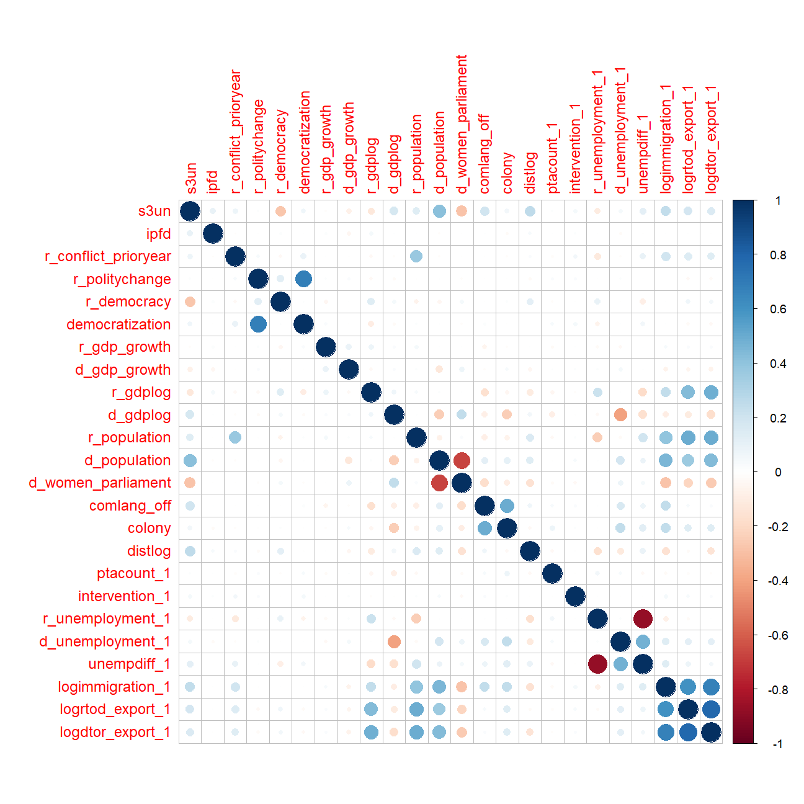

```{r setup, include=FALSE}
knitr::opts_chunk$set(echo = TRUE)

pacman::p_load(tidyverse,
               plyr,
               corrplot,
               stargazer,
               readr,
               texreg,
               psych,
               countrycode,
               readxl,
               multiwayvcov,
               lmtest,
               plm,
               igraph,
               texreg,
               gdata,
               lfe,
               sandwich,
               reshape,
               igraph)

```

### About the data

**Unit of analysis**: dyad-years

**Donor countries**: 35 countries

**Recipient countries**: 129 countries

**Time frame**: 1991-2014


```{r import dataset, echo = FALSE}
#import dataset
fulldata <- read.csv("UNGA_fulldata.csv", stringsAsFactors = F)


#create a dataframe with only the variables that will be shown in the descriptives
descriptives_data <- select(fulldata, 
                            aidflow_corrected,
                            s3un,    #ideal points
                            ipfd,    #first difference in ideal points
                            r_conflict_prioryear,
                            r_politychange,
                            democratization,
                            r_democracy,
                            r_gdp_growth,
                            d_gdp_growth,
                            r_gdplog, 
                            d_gdplog,
                            r_population,
                            d_population,
                            d_women_parliament,
                            comlang_off,
                            colony,
                            distlog,
                            ptacount_1,
                            intervention_1,
                            r_unemployment_1,
                            d_unemployment_1,
                            unempdiff_1,
                            logimmigration_1,
                            logrtod_export_1,
                            logdtor_export_1)


```


***

<br>
<br>


### Democracy aidflow (1988-2016) as a bilateral network

* In this animation showing the flow of democracy aid over the years, it can be noted that:
  - The volume of democracy aid increased rapidly in the 2000s
  - In the post-9/11 period, we see the emergence of the USA as a major donor and Iraq and Afghanistan as major recipients of democracy aid


<br>
<br>


***

### Descriptive Statistics

```{r descriptive table 1, echo = F, results = 'asis'}

#Descriptive Statistics Table
stargazer(descriptives_data,
          type = "html",
          covariate.labels = c("Aidflow (per 1000, logged)",
                               "Ideal Point Difference",
                               "Change in Ideal Point Difference",
                               "Conflict, Prior Year, R",
                               "Democratization (ord), R",
                               "Democratization (dummy), R",
                               "Democracy (ord), R",
                               "GDP growth, R",
                               "GDP growth, D",
                               "GDP (logged), R",
                               "GDP (logged), D",
                               "Population (logged), R",
                               "Population (logged), D",
                               "Women in Parliament (%), D",
                               "Common Official Lang.",
                               "Past Colonial Relationship",
                               "Distance (km, logged)",
                               "# of PTAs",
                               "Military Intervention (dummy)",
                               "Unemployment Rate, R",
                               "Unemployment Rate, D",
                               "Unemployment Difference",
                               "Immigration (logged), R to D",
                               "Export (logged), R to D",
                               "Export (logged), D to R"),
          title = "Descriptive Statistics, 1991 - 2014")


```


***

<br>

### Correlation among variables

Before building a model with the available data, it is a good idea to check the correlation of the data to avoid multicollinearity.

  + Most of the highly correlating variables are as expected (such as the democratization dummy and change in Polity score, since the democratization dummy is based on the Polity score).



